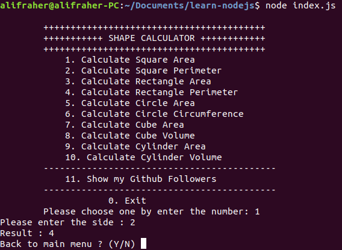

# Learn Nodejs

Learn basic NodeJs by making Calculator Shape Application 

---

## Usage

```sh
npm install
node index.js
```

---

## Features

1. Calculate Square Area
2. Calculate Square Perimeter
3. Calculate Rectangle Area
4. Calculate Rectangle Perimeter
5. Calculate Circle Area
6. Calculate Circle Circumference
7. Calculate Cube Area
8. Calculate Cube Volume
9. Calculate Cylinder Area
10. Calculate Cylinder Volume

---

## Screenshot



---

### Supported by

[](https://glints.com/) [](https://impactbyte.com/)


